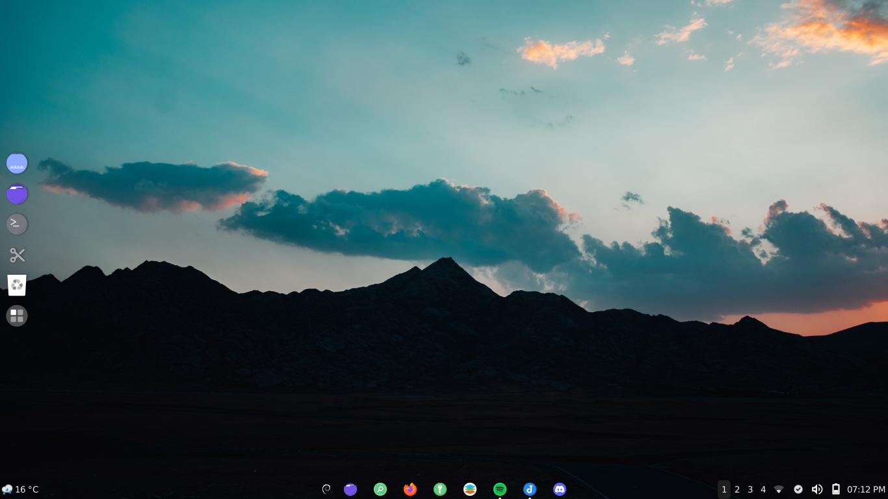

# Debian12Nirvana
Welcome to Debian12nirvana! This repository contains the configuration files for my XFCE desktop environment on Debian 12. By sharing these configurations, I hope to help others achieve a similar setup or provide a starting point for their own customizations.

## Contents

This repository includes the following files and directories:

- `xfce4_copy.tar.gz`: A compressed file of the `.config/xfce4` directory.
- `Wallpaper_1920x1080.png`: 1920x1080P resolution wallpaper.
- `README.md`: This file.
- `Screenshot.png`: A screenshot of the desktop environment.

## Screenshot

Here's a preview of the desktop environment:

The background is from Mohammad Alizade, can be cuztomized on [here](https://wallhaven.cc/w/vmkl78).

## Prerequisites

Ensure you have the following software installed:
- Debian 12 with XFCE desktop environment.
- Basic command-line knowledge.

## Installation

To use the configurations in this repository, follow these steps:

### 1. Clone the Repository

Clone the repository to your local machine using the following command:

git clone https://github.com/yourusername/Debian12nirvana.git

### 2. Extract the Compressed File

Navigate to the cloned repository directory and extract the xfce4_copy.tar.gz file:

cd Debian12nirvana
tar -xzvf xfce4_copy.tar.gz -C ~/.config/

### 3. Backup Existing Configurations (Optional)

If you have existing XFCE configurations, it is recommended to back them up before copying the new ones:

mv ~/.config/xfce4 ~/.config/xfce4_backup

### 4. Apply the New Configurations

Move the extracted xfce4_copy directory to your .config directory and rename it to xfce4:

mv ~/.config/xfce4_copy ~/.config/xfce4

### 5. Restart XFCE

Restart your XFCE session or reboot your system to apply the new configurations.

## Verification

After restarting, your desktop should reflect the new configurations. Check for the following:

	•	The desktop environment resembles the screenshot provided.
	•	Custom themes and panels are applied correctly.

## Troubleshooting

If you encounter issues, consider the following steps:

	•	Ensure you followed all steps correctly.
	•	Check file permissions using ls -l ~/.config/xfce4.
	•	Restore the backup configuration if necessary.

## Restoring Original Settings

To revert to your original settings, restore the backup:

mv ~/.config/xfce4_backup ~/.config/xfce4

Then restart your XFCE session.

## Contributing

If you have any improvements or suggestions, feel free to create a pull request or open an issue.

## License

This project is licensed under the MIT License - see the LICENSE file for details.

## Acknowledgements

Thanks to the XFCE community and all contributors who help make this desktop environment amazing.

Happy customizing!
